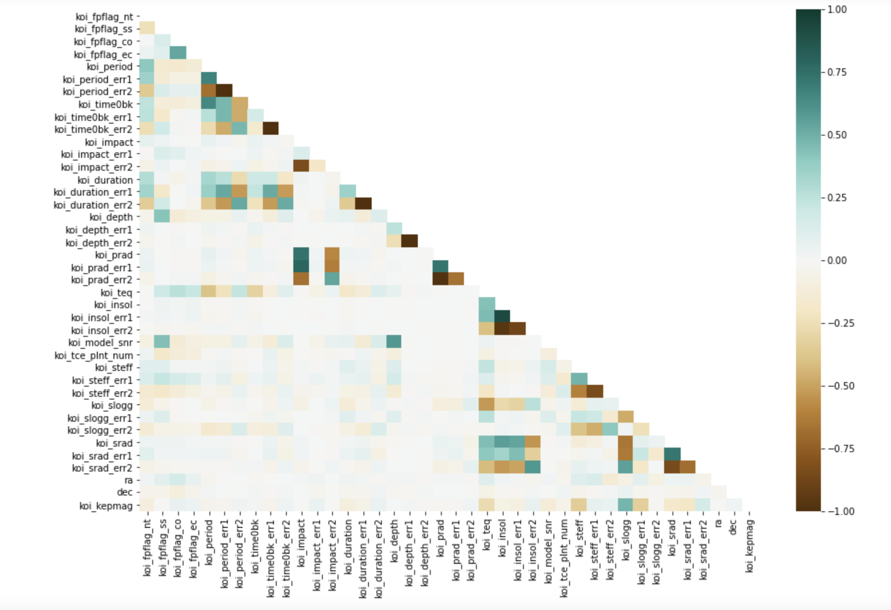
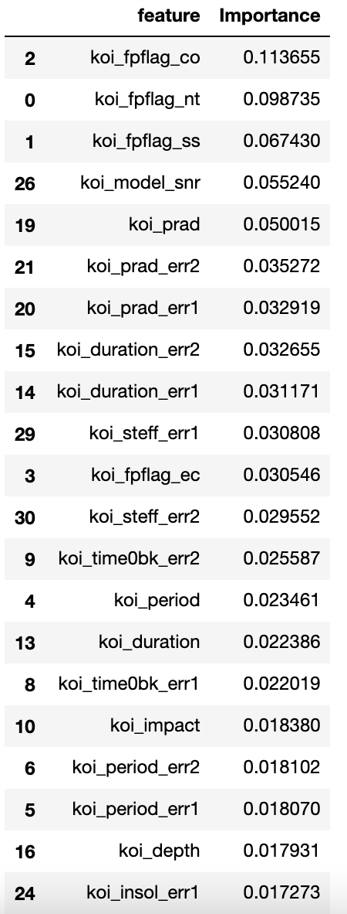
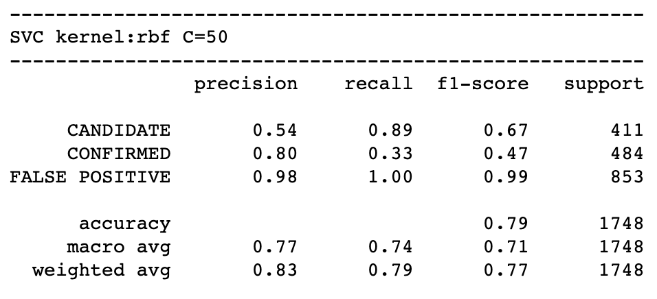
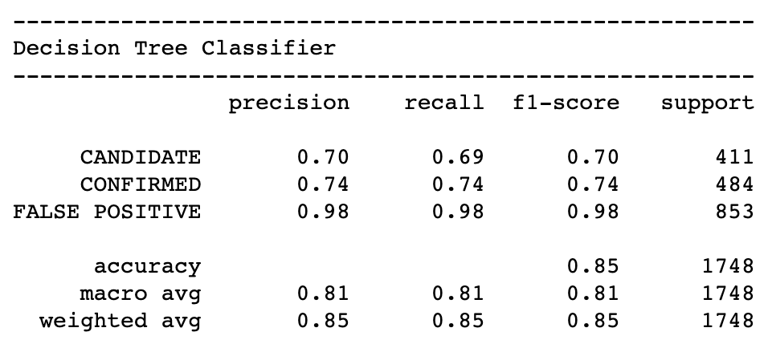
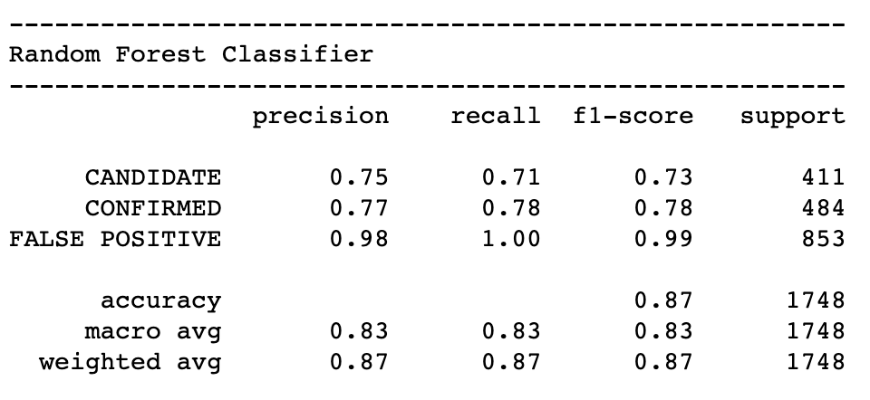
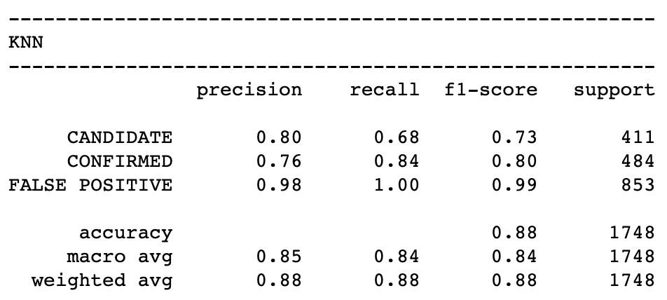

# machine-learning-challenge

>  Create machine learning models capable of classifying candidate exoplanets

## Table of contents
* [General Information](#General-Information)
* [Feature Selection](#Feature-Selection)
* [Compare Models](#Compare-Models)
* [Analysis](#Analysis)
* [Technologies](#technologies)
* [Contact](#Contact)

## General Information
Over a period of nine years in deep space, the NASA Kepler space telescope has been out on a planet-hunting mission to discover hidden planets outside of our solar system.

To help process this data, multiple machine learning models were tested to find the best model which is capable of classifying candidate exoplanets from the raw dataset.

Documentation: [Exoplanet Data Source](https://www.kaggle.com/nasa/kepler-exoplanet-search-results)

Best Model[KNearestNeighbor](exoplanet_model.sav)


## Feature Selection
Determined the best features by using a heatmap comparing all features and RandomForestClassifier model to find the most important features.

Features that are more green are highly correlated and thus not a good option to include in the feature selection.



Features that have err in their name are part of "Uncertainties Column" in the dataset and have been excluded.



The final features selected are ```koi_fpflag_co, koi_fpflag_nt, koi_fpflag_ss, koi_model_snr, koi_prad and koi_fpflag_ec``` as they had the highest importance.


## Compare Models






## Analysis

SVC model with kernel=rbf and C=50 had the lowest accuracy of 0.79. Next came the Decision Tree Classifier model with an accuracy of 0.84. Both KNearestNeighbor and Random Forest Classifier had higher accuracy scores of 0.88 and 0.87 respectively. While the Random Forest Classifier is better suited for disproportionate data, as in the exoplanet data, the KNearestNeighbor gave a slightly better accuracy overall. The False Positive scores for both models are identical, whereas the Candidate and Confirmed scores are slightly better in the KNearestNeighbor model with k=7. Thus the best model for this data set would be KNearestNeighbor.

## Technologies
* Python
* Pandas
* matplotlib
* numpy
* seaborn
* sklearn
* joblib

## Contact
Created by [@deepavadakan](https://github.com/)